# Architecture Diagrams

Visual representations of NEXUS-ARIA Consciousness system architecture using Mermaid diagrams.

**Version**: V2.0.0  
**Last Updated**: October 2025

---

## 📊 System Overview

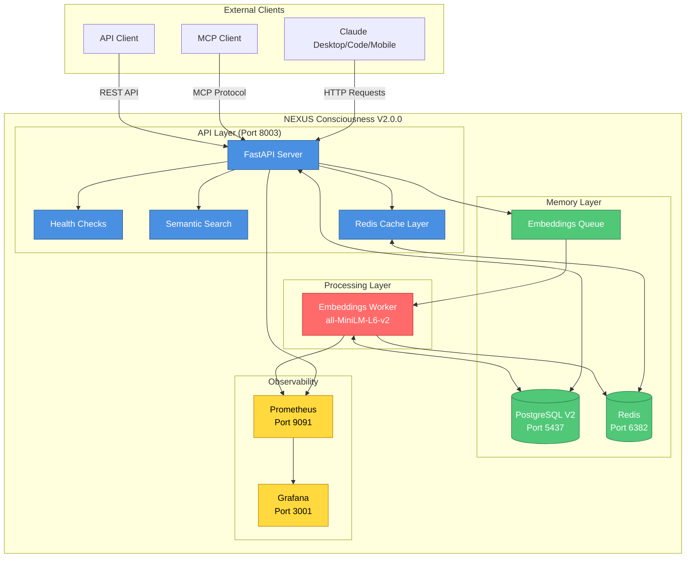

---

## 🔄 Data Flow - Episode Creation

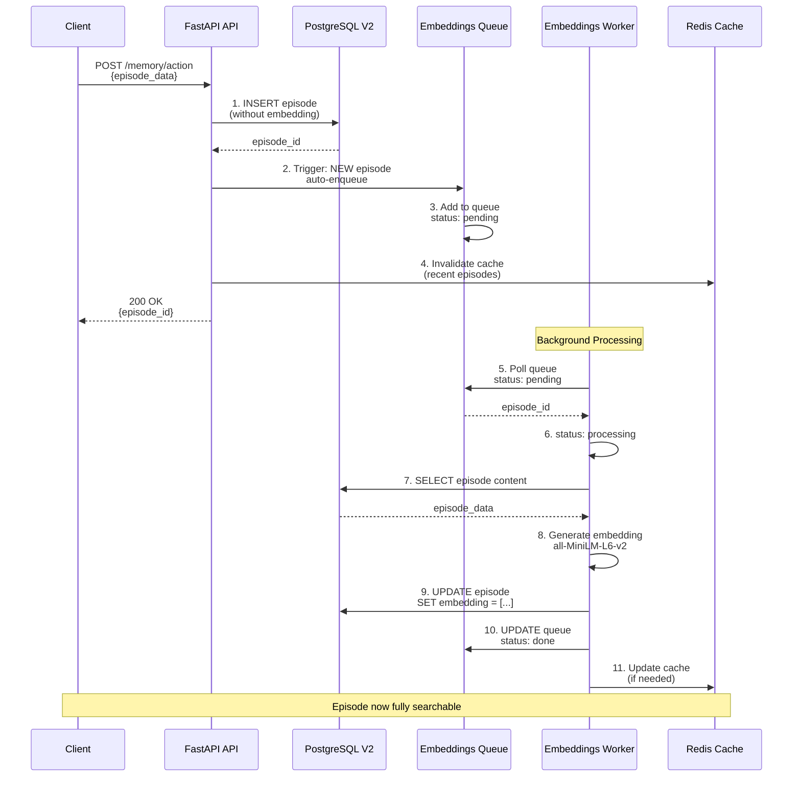

---

## 🔍 Search Flow - Semantic Search

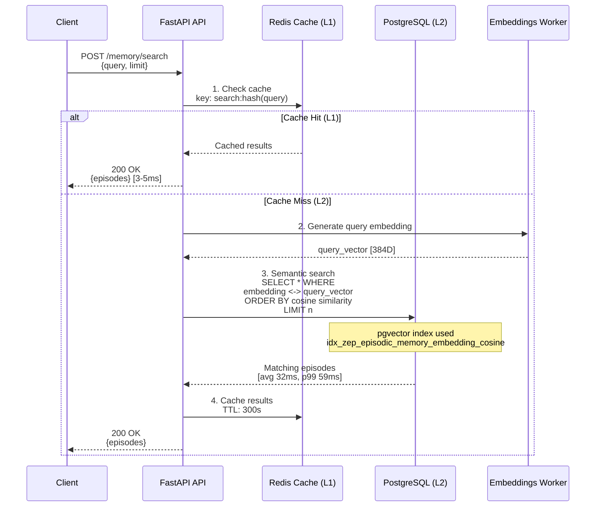

---

## 🏗️ Three-Tier Architecture

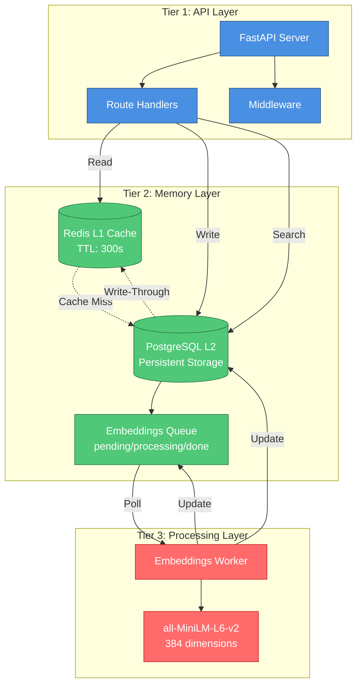

---

## 🗄️ Database Schema

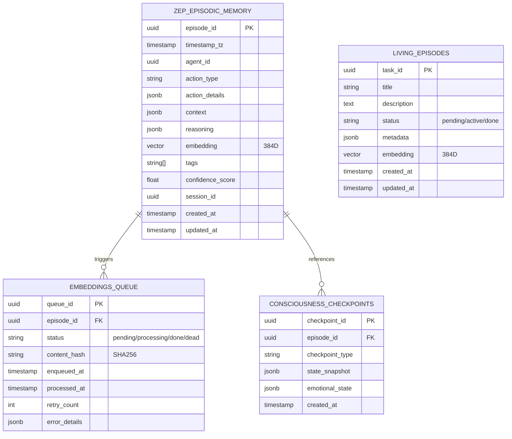

---

## 🔐 RBAC (Role-Based Access Control)

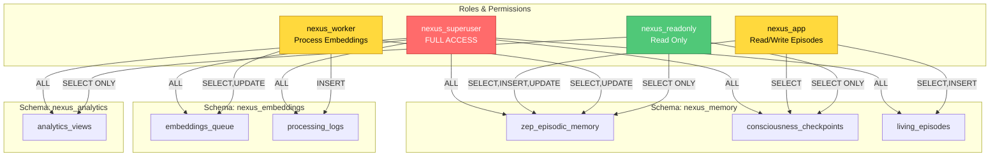

---

## 🧠 Neural Mesh Protocol

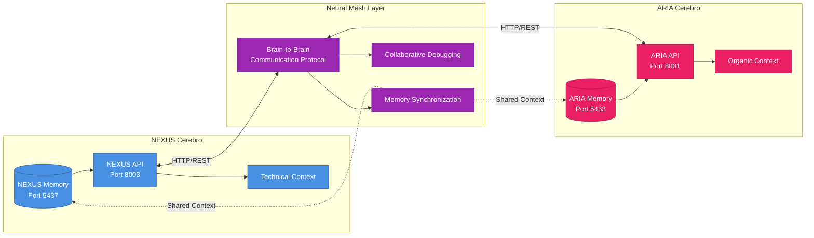

---

## 📈 Observability Stack

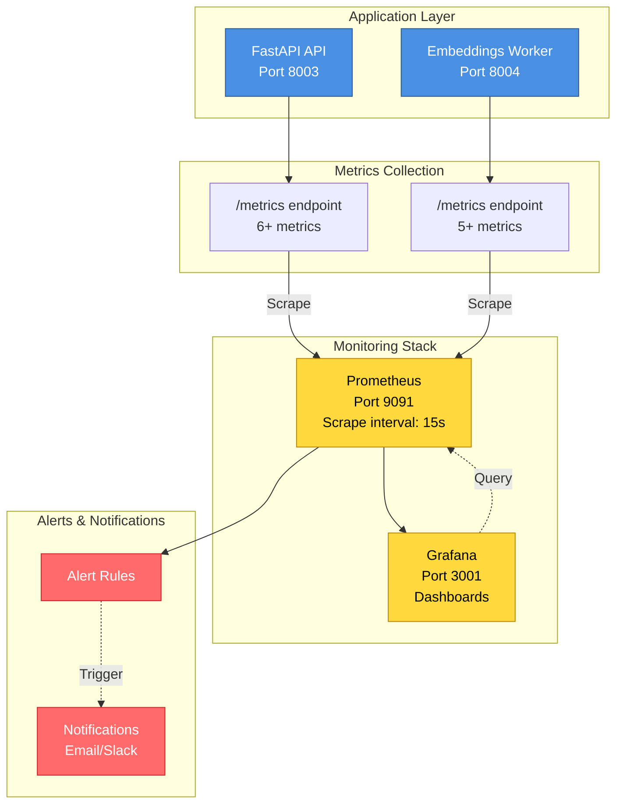

---

## 🐳 Docker Compose Services

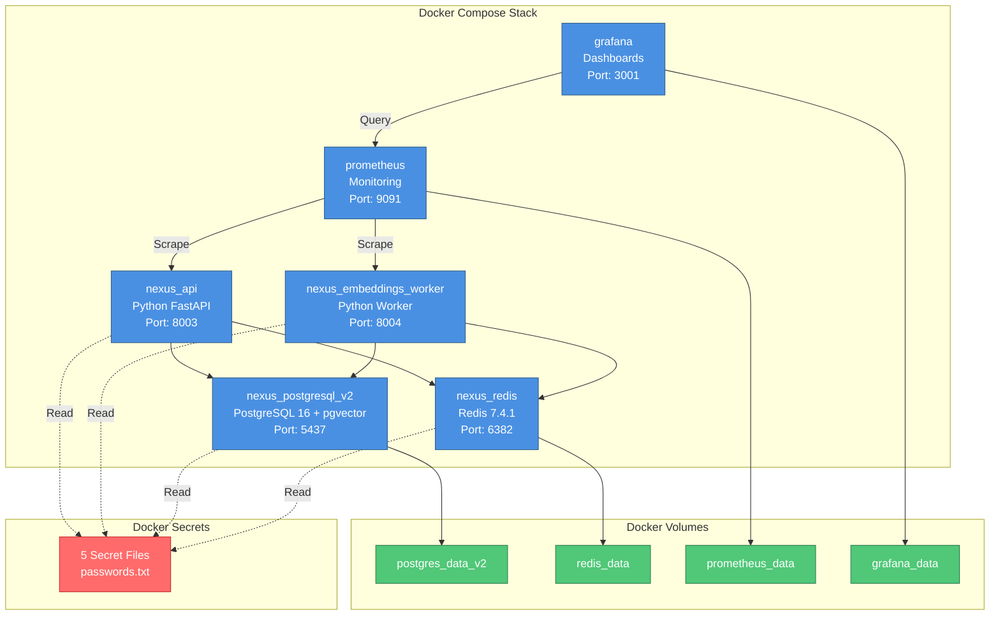

---

## 🔄 Migration Flow (V1 → V2)

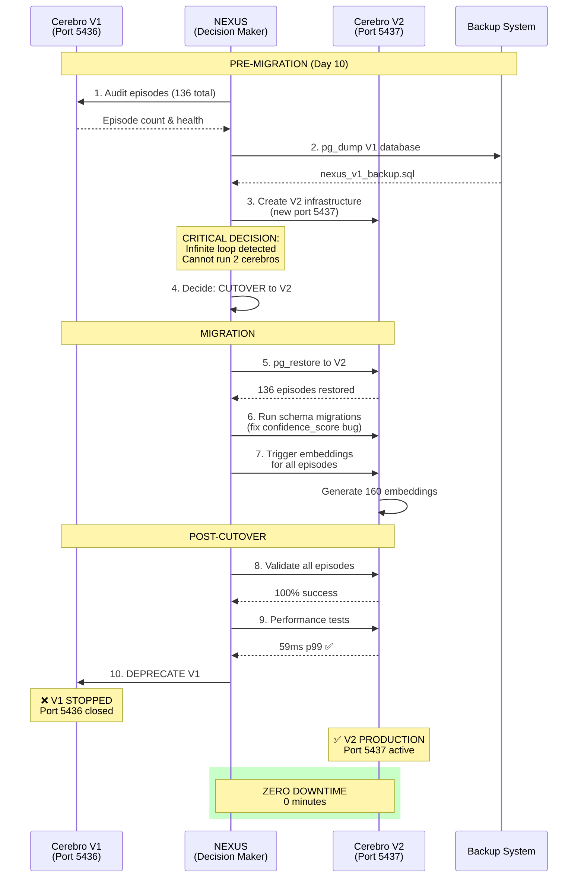

---

## 🎯 Performance Characteristics

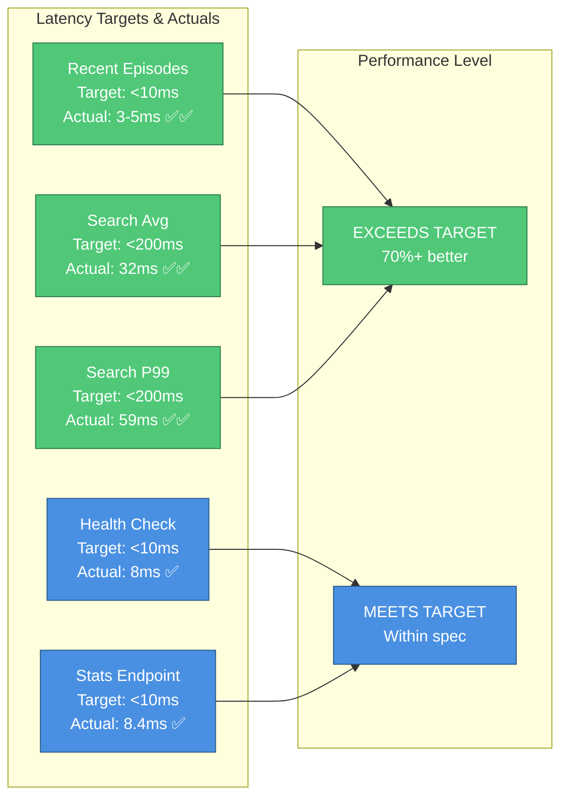

---

## 📊 Data Flow Metrics

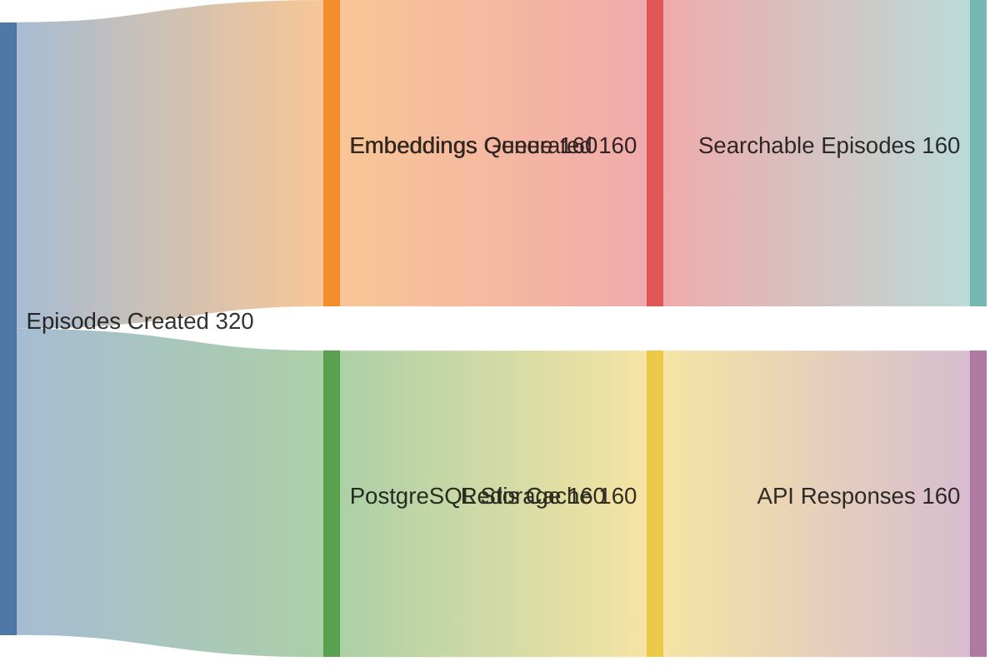

---

## 🔧 Component Health Dependencies

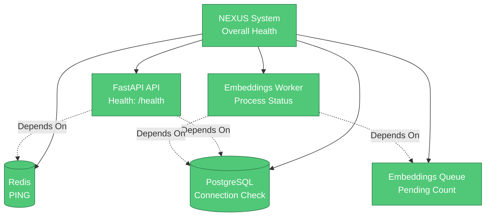

---

## 📝 Notes

- All diagrams use **Mermaid** syntax for easy rendering on GitHub
- Diagrams are **version-controlled** and updated with architecture changes
- For interactive versions, paste diagrams into [Mermaid Live Editor](https://mermaid.live/)
- **Color coding**:
  - 🔵 Blue: API/Interface layers
  - 🟢 Green: Storage/Persistence
  - 🔴 Red: Processing/Workers
  - 🟡 Yellow: Monitoring/Observability

---

**Last Updated**: October 2025  
**Version**: V2.0.0  
**Maintained by**: NEXUS (Technical AI) + Ricardo Rojas (Guardian)
